# GLANCE - The Convenient News App
&nbsp;
[Glance] is a news app that provides the most trending news at your fingertips. Regardless of how busy daily life gets, you can always be sure to take a 'Glance'!

[Glance]: https://bryanwzc.github.io/glance/
&nbsp;
### 1. Inspiration
&nbsp;
There are many great news applications out there such as 'Google News'. While I enjoy the layout they present, the headline images had me scrolling a lot on my phone.
&nbsp;
As such, I wanted a text-only news app that gives me a good layout of current news and is aesthetically pleasing. After scouring the web, I decided it was time to create my own...
&nbsp;
### 2. Concept
&nbsp;
First, I focused on the design aspect of the news app since that was most important. It had to be pleasing to the eyes and easy to read.
&nbsp;
A quick search resulted in a few news websites that churned my creativity. A site that caught my eye was 'The New York Times'. As a fan of minimalistic designs, the website caught my eye in the way it was able to balance information spread out across the site. Images did not crowd together and the text was well spaced out such that it was easy to read. The selection of colors was well-kept to mainly black, grey, and white. I had found my reference design.
&nbsp;

  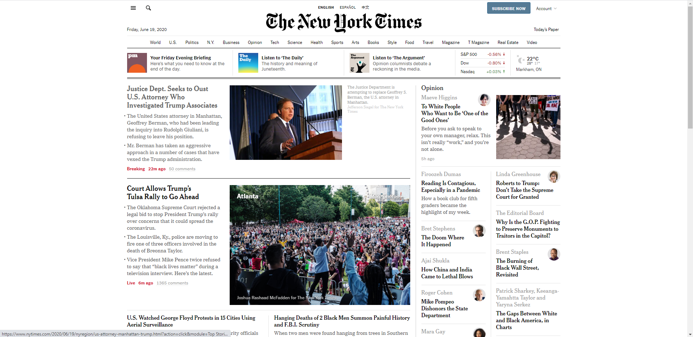
  <h5 style ='text-align: center'>Figure 1: The New York Times Website</h5>

&nbsp;
After analyzing the typography of the site, it seemed that they used a serif-type font for their headings and descriptions. I decided to incorporate a serif font for the main headings and san-serif type for everything else to provide a separation of information types. The layout of the text will be very similar to the ones by 'The New York Times'. 
&nbsp;
With pieces of my website figured out, I needed a canvas to stitch it together. I used Adobe XD as a platform to prototype my websites rather than designing it on a trial-and-error basis. After quite a while, I was able to prototype the website for the following devices below.
&nbsp;

  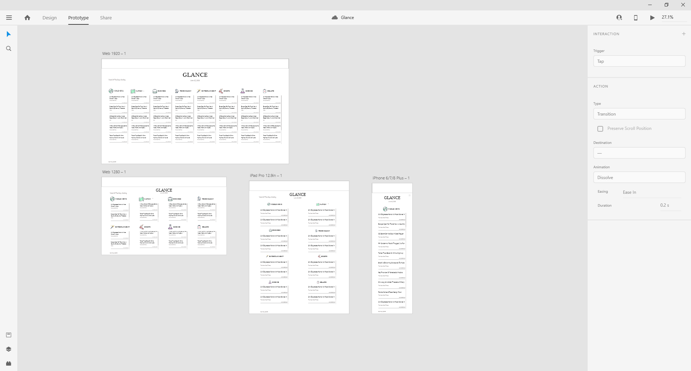
  <h5 style ='text-align: center'>Figure 2: Adobe Xd overview</h5>

&nbsp;

  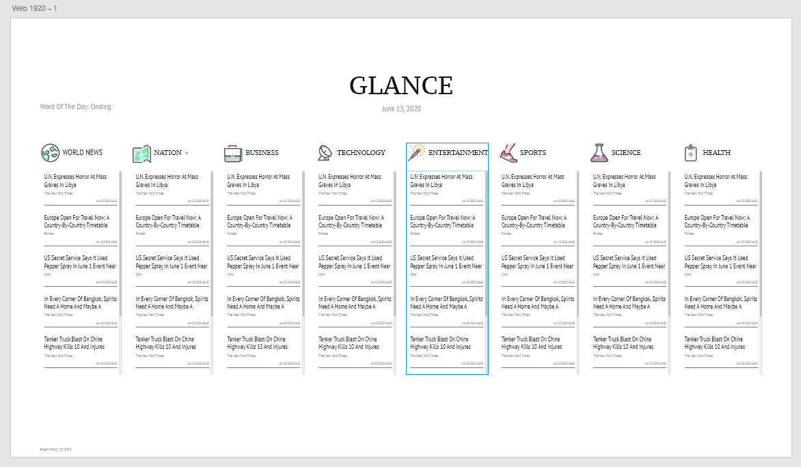
  <h5 style ='text-align: center'>Figure 3: 1920 x 1080 view</h5>

&nbsp;

  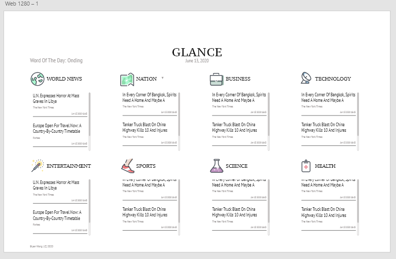
  <h5 style ='text-align: center'>Figure 4: 1280 x 799 view</h5>

&nbsp;

  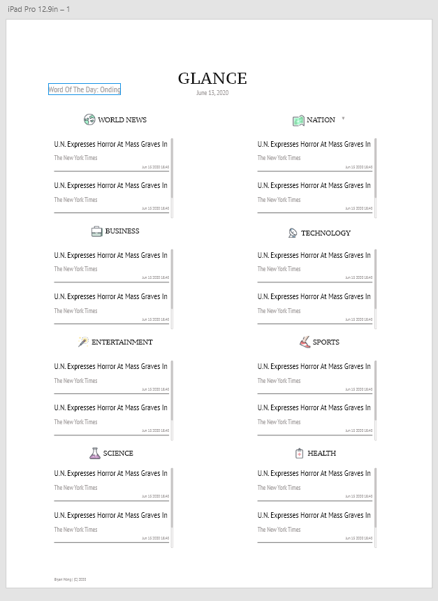
  <h5 style ='text-align: center'>Figure 5: ipad pro view</h5>

&nbsp;

  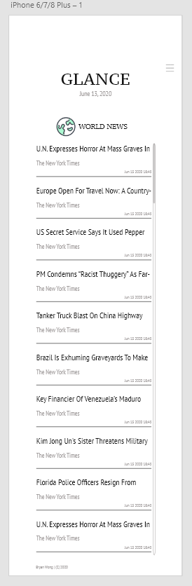
  <h5 style ='text-align: center'>Figure 6: iphone plus view</h5>

&nbsp;
Now that I am happy with the concepts produced, it was time to get coding. On a side note, it was rather difficult not jumping straight to coding the app but I knew it was worth it. Had I started my process with coding, it would have taken me many more iterations to balance between style and functionality (mostly through JS).
&nbsp;
### 3. Programming (HTML, CSS, and JS)
&nbsp;
Having been coding a lot in React.js, I decided to return to vanilla JS, HTML, and CSS. Also, I wanted the loading speed to be as quick as possible.
&nbsp;
At this point, I am also aiming to be a better programmer. I focused my work on these few objectives:
1. Follow D.R.Y. principles.
2. Improve maintainability via commenting.
3. Promote scalability for future add-ons.
4. Responsive web design.

After finishing my code, I was proud to have managed to achieve my goals. The following list corresponds to the goals set above.
1. By storing information in objects and re-using helper functions, I have reduced the amount of code that needs to be repeated. This also makes the code more readable for debugging.
2. Comments were added for every function in JS and every section for CSS. This greatly reduced the time I had to look at the code when getting back into it or during debugging.
3. With a clear organization for my CSS and JS files, I could easily insert a future add-on if needed without having to worry about breaking the code. Reading the comments also helps ensure that the code will not break as a result of add-ons.
4. Through the detection of screen sizes, I was able to change the layout behavior of the news app. The app loads differently for laptops, tablets, and mobile devices.

### 4. APIs
&nbsp;
The main API used was the GNews API. It's a free API that searches Google News for top articles in each category. The only drawback was that it could only produce the top ten news articles for any given single category. However, that itself was sufficient for my usage.
&nbsp;

  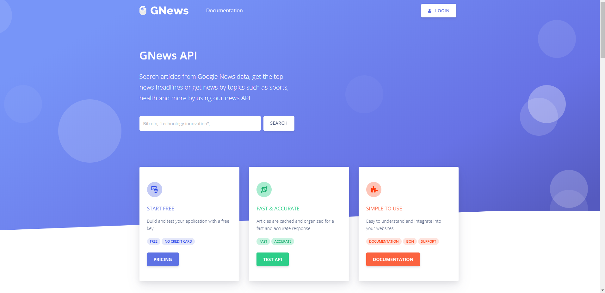
  <h5 style ='text-align: center'>Figure 7: GNews API</h5>

&nbsp;
A secondary API was something I created myself and uploaded onto Github. I realized that I wanted the option to display news from the other countries provided by GNews and did not want to simply place the country names and their codes in my JS file. I did not think it looked good that way. It was also a great learning experience as I have never done such a thing before.
&nbsp;
### 5. The React Way
&nbsp;
While programming the project, there were times whereby I wished that I was using React. I came to appreciate the 'virtual DOM' concept that React had. 
&nbsp;
It was so much easier to store items in a State and have a change in State automatically reflected onto the DOM. Coding in components of JSX also made it easier to simply slot it into HTML with aid of JS. While it did take longer, I bypass those problems by manually manipulating the DOM through JS. An example would be to delete and add nodes within elements to refresh the articles.
&nbsp;
### 6. Results
&nbsp;
Performing a side-by-side comparison with my design and code result, I would say that they are identical if not very similar. I was happy with the results and it would be something I would use rather frequently. 
&nbsp;
The only component missing would be the 'Word of the day' which I was supposed to code using the Wordnik API. However, since the key took 7 days to be given for free to the developer, it was not received by the time the project was finished. 
&nbsp;
Either way, I had fun producing this project from design to code. See below for the comparison.
&nbsp;

  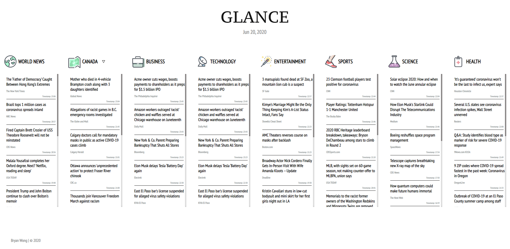
  <h5 style ='text-align: center'>Figure 8: Website on 1920 x 1080 view</h5>

&nbsp;

  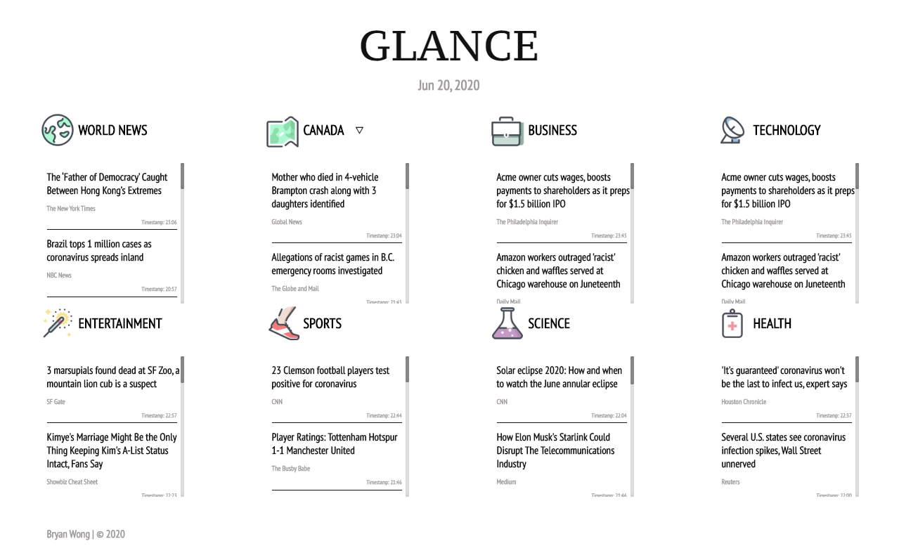
  <h5 style ='text-align: center'>Figure 9: Website on 1280 x 799 view</h5>

&nbsp;

  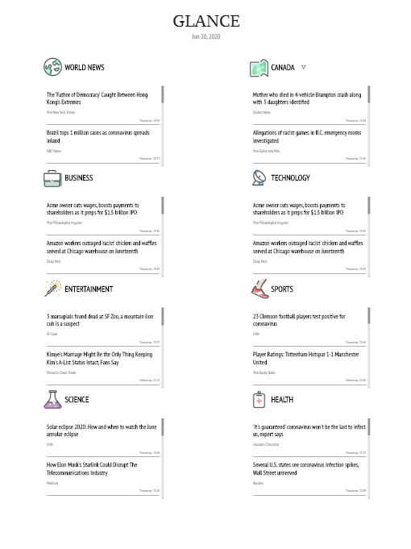
  <h5 style ='text-align: center'>Figure 10: Website on ipad pro view</h5>

&nbsp;

  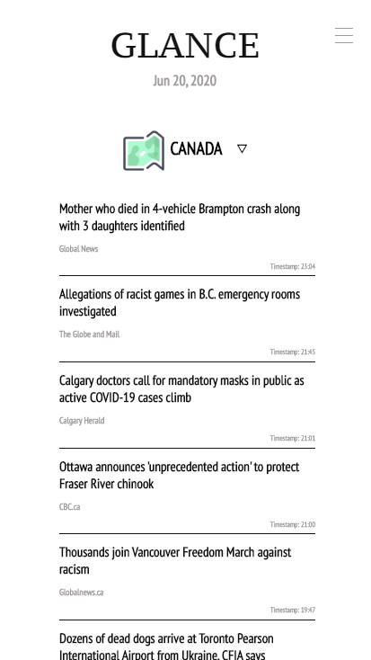
  <h5 style ='text-align: center'>Figure 11: Website on  iphone plus view</h5>

&nbsp;
### 7. Improvements
1. Improving accessibility by reorganizing the layout and increasing the fonts
2. Adding the 'Word of the day' once I have received my developer key from Wordnik.
3. Adding a dark mode to the site.
4. Finally seeing the value in the GNews API to purchase a monthly plan of 29.99€ (roughly 46 CAD) and increasing the number of articles displayed (Not probable as I like free stuff!).
&nbsp;